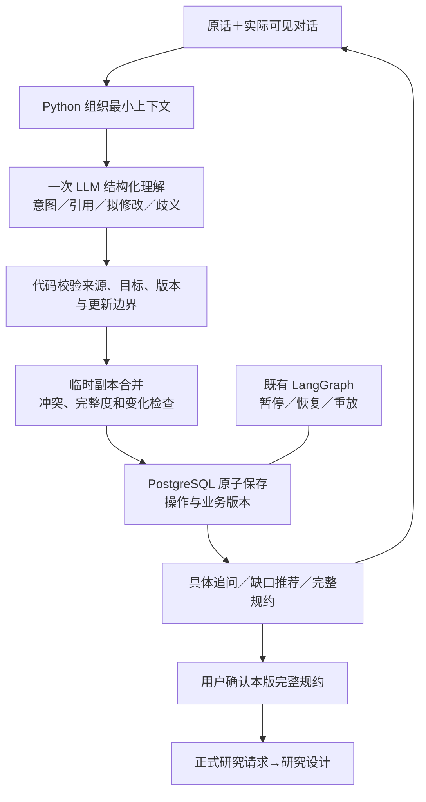

# LAPIS 第一模块：上下文、更新保护与完整对话测试计划 v2

日期：2026-10-09；状态：**供审阅，等待实施确认**。范围仅限问题受理与研究规约。

## 一屏摘要

1. **最大返工风险是继续修短句，而不统一操作契约。** 当前类型校验能保证 JSON 形状，不能保证范围回答不会替换目标、引用提案不会变成用户约束。应先明确问题引用、操作对象、来源和删除／替换边界，再调整提示词。
2. **保留现有 Python、Instructor/Pydantic、LangGraph、PostgreSQL 和 CLI。** 用一次结构化调用同时理解意图、指代和拟修改项；确定性代码检查引用、版本、受影响项及冲突。不新增生产 Agent、数据库、向量库、NLP 管线或前端。
3. **交接是“可进入研究设计”，不是“可直接计算”。** 八项始终存在，但条件、具体候选、指标和方法可待设计；定性关注点允许交接。已选指标必须保留；未知、无预设和委托后续确定不能混同。系统整理的范围／功能摘要必须在最终规约中由用户核对。
4. **第一个有实际价值的交付物：** 一份经审阅的规则契约、原始长对话逐轮预期状态，以及零收费的完整回放测试。其验收核心是“氧化诱导期持续保留、推荐来源不污染、范围回答不改目标”，不是最终能否确认。
5. **当前基线：** `codex/intake-v3-development`，`a544748328b6e7f3eb30b4c111568390f079cdbb`；本轮开始工作区干净。上次中断前只有阅读／只读核对，没有留下源码修改。本轮只编写本计划，不运行模型测试、计算或数据库写入，不提交／推送。

**需要审批的核心解释：** 采用第 4 节的粗研究边界交接门槛，并允许系统依据已有意图整理范围和拟承担功能，用户一次核对整份规约后采用。其余工程组织由执行者按本计划处理。

---

## 1. 证据、现状与未验证事项

### 1.1 来源等级

- **[用户需求]** 八项内部结构、泛用自然语言受理、来源保留、版本确认、未知与矛盾区分；本次授权仅规划。
- **[设计材料]** `F:/LAPIS/LAPIS设计 -V2.docx`、`F:/LAPIS/典型任务的模块流转与状态示意.json`。
- **[审查材料]** `C:/Users/98439/Documents/Codex/2026-09-29/new-chat/LAPIS-第一模块复审与改进方案-v1.md` 和同目录 `lapis-audit-2026-10-09/user-long-dialogue-audit.md`。已完整阅读；它们的方案不是已实施事实。
- **[代码事实]** 本轮读取 README、受理／契约／推荐／展示／图／存储、相关测试与迁移；未发现仓库根目录或 `F:/AGENTS.md` 指令文件。继续遵循已指定 ponytail skill：复用现有能力、修共用根因、避免新平台。
- **[历史验证记录]** reports 中 UI 与 short-reply 报告、JSONL、现场展示、汇总和失败记录。本轮只审阅，没有重跑其测试。
- **[本计划建议]** 下述语义操作契约、版本 v5、上下文窗口和测试预算均为拟议决定，不能据此宣称已经具备这些能力。

### 1.2 已实现、缺陷、未验证清单

| 分类 | 可核对位置 | 事实／影响 |
|---|---|---|
| 已实现 | [Extraction](F:/LAPIS/lapis_intake.py:84)、[extract](F:/LAPIS/lapis_intake.py:213) | 固定类型、动作、更新、部分／整体选择、歧义和具体问题。仍未给出稳定的问题引用及每个操作的意图依据。 |
| 已实现 | [handle_turn](F:/LAPIS/lapis_intake.py:675) | 在副本上处理，抽取或推荐失败不替换原状态。保持该原子性。 |
| 已实现 | [save_turn](F:/LAPIS/lapis_store.py:158)、[图处理](F:/LAPIS/lapis_graph.py:31) | revision 检查、事务、操作幂等、同任务并发锁、业务提交后 checkpoint 故障恢复。它们保护工程状态，不保证语义正确。 |
| 已实现 | [_confirm](F:/LAPIS/lapis_intake.py:601)、[run_chat](F:/LAPIS/lapis.py:212) | 先解释实际缺口，完整展示和版本确认、/show 本地回执、恢复；进度与确认部分区分已有回归。 |
| 仍存在 | [extract](F:/LAPIS/lapis_intake.py:213) | 输入没有近期用户／系统可见原文、已采用方向完整上下文和稳定当前问题 ID。仅靠可能出错的字段快照理解省略。 |
| 仍存在 | [_merge](F:/LAPIS/lapis_intake.py:274) | 接受模型 replace 后清空整个列表；没有足够保护此前已选指标。只核对 quote 是本轮片段，不能证明它授权修改该字段。 |
| 仍存在 | [_ground_actions](F:/LAPIS/lapis_intake.py:399) | 部分更新以值包含于原话等词法条件处理；范围回答可退回原句。“都包含”可通过合法形状而成为脱离上下文的范围。 |
| 仍存在 | [_merge](F:/LAPIS/lapis_intake.py:274)、[_select](F:/LAPIS/lapis_intake.py:448) | 对象／用途／范围字符串变动触发重核；未充分区分补齐未知、兼容细化、重述和真正切换。 |
| 仍存在 | [_ground_actions](F:/LAPIS/lapis_intake.py:399)、[_record](F:/LAPIS/lapis_intake.py:248) | 推荐文本未有完整的“引用”路径；被抽成用户 updates 后会记为用户约束或研究参考。 |
| 仍存在 | [SYSTEM_PROMPT](F:/LAPIS/lapis_intake.py:111) | “仅从本轮原话提取”与“按上下文归纳”；“局部选择 replace 排除其他目标”与“只有明确整体替换才 replace”未统一。普通研究行动还可能被过度要求选范式。 |
| 仍存在 | [request_issues](F:/LAPIS/lapis_contract.py:69) | 条件／约束可未知，但五个标量要求明确。模型额外加入的“必须有具体指标”歧义仍能阻断，不能只改固定 missing 规则。 |
| 仍存在 | [generate_recommendations](F:/LAPIS/lapis_proposals.py:92) | 没有明确的“补当前缺口”与“换完整方向”模式。已有方向后请求推荐仍可能产生整套方向。 |
| 仍存在 | [render_intake_result](F:/LAPIS/lapis.py:166) | 日常变化只显示前三字段；删除、替换及范围变化可能被截掉。操作 result 不等于实际打印文本。 |
| 验证局限 | [短答脚本](F:/LAPIS/scripts/verify_short_reply.py)、[UI 脚本](F:/LAPIS/scripts/verify_intake_ui.py) | 脚本读取内部 asked_field／推荐字段并构造回答，不是独立模拟用户；short-reply 没有覆盖此次指标跨多轮保留问题。 |

历史材料中可查到 84 项软件测试日志、两类短答 17 回合确认与恢复，以及 UI 三场景测试。short-reply JSONL 共 120 条记录，包含 5 个失败场景终判；UI JSONL 共 55 条，包含失败轮次。**这些有限样例不能推导长对话正确或全材料领域可靠。**现有 84 项并非本轮重新通过的结果。

### 1.3 长对话运行基线：能判断什么

前一被中断的修复轮已只读定位实际任务 `540ba769-e98a-4f18-a07b-18d30bc791bb`：18 轮原话与此次轨迹相符；最终当前目标只剩“抗氧化性”，第 9 轮指定的“氧化诱导期”不在最终规约。其审计记录的提示词哈希为 `a1928a753eec02f20a5ffb8623be41ead16df0fa09c8b05c563a4cae1274ee3f`，与当前提示词及 `093739c` 对应提示词一致，与更早短答提交不同。

**结论：不能把问题归咎旧提示词；也不能凭提示词哈希证明整个进程代码版本或启动时间。**既有记录没有完整代码哈希、PID／启动标识和每轮 Extraction，所以无法确证该会话是否旧进程，或每一步究竟先由模型还是合并代码出错。本轮不重写该任务，不再读取数据库；新方案验收必须在记录启动版本的新进程进行。

---

## 2. V2 对齐、冲突与审批解释

| 来源 | 已明确内容／不一致 | 建议统一及影响 | 审批 |
|---|---|---|---|
| V2 §2.1 模块职责 | 第一模块澄清；第二模块检查科学合理性、输入完整性、方法／资源及结果可判定性，必要时返回受理 | 不把具体方法、模型、参数、评价公式作为第一模块必答题。未知作为交接待办，不代表设计可审批。 | 现有边界，保留 |
| V2 §2.2 概念 4“最小可计算研究请求” | 足以进入研究设计，不一定可直接提交计算 | 统一代码术语为研究请求；本模块确认只表示用户同意研究意图。 | 现有边界，保留 |
| V2 §2.2.1“研究任务” | 具有明确对象、条件、目标、范围，可执行和验收；容易被理解为受理时全部具体 | 将意图确认与执行可行性分层：条件可以未定，但已知条件不得省略；具体执行门槛留第二模块。 | **需批准宽严统一解释** |
| V2 §2.2 概念 6、§2.2.1“目标性能” | 概念映射描述带数值／单位／条件的可观测量；§2.2.1 使用“尽可能明确” | 第一模块允许定性关注点；研究设计再确定观测定义、单位、条件、方法。已选“氧化诱导期”必须保留，但不承诺可由某软件直接得到。 | **同一门槛解释审批** |
| V2 §2.2.1“研究目的” | 行动或希望得到的判断，示例为筛选 | 允许研究、考察、探索；示例不能变成强制枚举。不因未选筛选／比较就判目的缺失。 | 无新增职责 |
| V2 §2.2.1“材料功能”“范围与非目标” | 希望承担的作用；界定本轮内容和承诺 | 可依据已明确的对象／用途／目标整理摘要，显示为待采用内容，由用户核对整份规约后采用；不自行增加候选、机制或承诺。 | **需批准摘要采用方式** |
| JSON 任务 001/002/003 | 嵌套／字段命名不一致；候选有时在受理输出；目标形状不同；003 为药物先导筛选 | 八项输出继续统一；已有候选作为用户输入保存，候选设计仍属第二模块。003 只作边界测试，不扩展首版药物范围。 | 不扩范围；要支持药物需另案 |
| JSON 全部“已完成”及示例数值 | 无真实原始计算证明 | 只用作概念／字段映射资料；不得移作科研验收。 | 无需新审批 |

审批项不是扩大五段流程，而是澄清首模块与设计模块之间的宽严边界。审批前不实施门槛放宽。没有提出取消材料用途要求或开放药物筛选。

---

## 3. 目标数据流和技术职责



| 技术 | 用途与选择依据 | 不承担的判定／退出成本 |
|---|---|---|
| Python 标准库 | 引用解析、变化计算、状态合并、规则、文本／JSONL记录；职责沿现有文件分开 | 无法证明语言解释正确；不要为这一模块建通用规则引擎 |
| Instructor/Pydantic | 同次调用产生类型约束的语义结果、严格字段与枚举、结构错误重试 | schema 合法不等于意图准确；模型接口继续可替换，依赖退出局限在调用及模型类型层 |
| LLM | 指代、同义、兼容性、引用／采用区分、问题措辞和建议 | 不是事实验证器或批准者；语义结果需要代码边界和对话评测 |
| LangGraph＋现有 PostgresSaver | 保留受理暂停／跨进程恢复，不按每个字段扩图节点 | 官方说明 checkpoint 保存线程状态、interrupt 恢复会重进节点，副作用仍需幂等；不能保证业务语义。[持久化文档](https://docs.langchain.com/oss/python/langgraph/persistence)、[中断文档](https://docs.langchain.com/oss/python/langgraph/interrupts)。不升级 SDK 来追新接口 |
| PostgreSQL | 唯一业务事实库，复用 JSONB 操作／请求／审计和锁 | checkpoint 不能替代业务版本；本计划不换数据库，不新建另一份会话事实库 |
| 研究人员／用户 | 明确真实需求、处理不可判断的修改、最终采用规约 | 确认不是性质核验；模型不能代确认 |

只在现有类型与函数中建立本次确需的边界。建议在 `lapis_intake.py` 分清 `build_context → interpret → validate_operations → apply_operations → assess_intake` 的可测试函数职责，复用现有函数和名称；文件明显难以阅读时才拆一个专用上下文文件，不预先分出通用 Agent／工作流平台。

推荐仍可有第二次模型调用，但仅在用户确需新内容时。先不加独立专业改写 Agent、第二审核 Agent、传统 NLP 或向量库。独立语义审核若后续有真实不变量失败、单次结构化调用已无法降低风险，才通过同一留出集比较收益、耗时、调用成本和维护负担后另行申请。

---

## 4. 八项结构、状态与交接门槛

**字段存在 ≠ 值必须已经指定。**八项固定，列表仍有稳定条目 ID；值允许 null。沿用五种状态：

- `unknown`：未提供／不知道，不能推成没有要求。
- `none`：用户明确本轮无预设此类要求；不能套用于对象或无限范围。
- `open`：明确留给设计或委托后续提出方案；不是授权系统任意取值。
- `unclear`：已有内容存在语义歧义、矛盾或适用性未解决。
- `specified`：意图明确；不说明性质已证实或计算输入完整。

| 字段 | 可进入完整核对／交接的最低要求 | 必须保留或阻断 | 当前验证器变更 |
|---|---|---|---|
| 研究目的 | 明确关注的行动或判断；研究／考察／探索均可 | “想研究材料”且无关注点需要澄清；不强制任务范式 | 移除模型提示中强制转筛选／比较的语义规则，task_pattern 可为 other |
| 研究对象 | 可理解且有边界的材料／体系类别 | 单一呋喃分子与一类衍生物不能自行互换；真正歧义阻断 | 允许具体候选待设计；保持用途／领域检查 |
| 应用场景 | 基本材料用途明确 | 日常生活等过宽时协助选择；无应用基础问题保持草稿 | 仍需基本用途；不要求服役细类、基体型号 |
| 工作条件 | 可 unknown、none、open；已知则保存 | 数值、单位不一致或与要求冲突不能以未知掩盖 | 保留温度／单位检查；不是必填门槛 |
| 目标性能 | 至少一个定性关注点与方向／考察意图 | 用户已选具体指标及其 ID、原话不可无意丢失；不承诺可计算 | 不将缺指标／公式本身变成 blocking issue；具体指标不是通行票 |
| 约束条件 | 可 unknown、none、open | 已有硬约束持续保留；科学限制不自动变偏好；互斥要求阻断 | 保留 hard/preference 和冲突规则 |
| 研究范围 | 本轮对象＋用途＋关注点形成可读粗边界；允许详细候选／变化／排除项待设计 | “都研究”“没有不研究的”不得成为无限范围或孤立正式原句 | 可呈现待用户采用的有界摘要；未同意的扩大仍阻断 |
| 材料功能 | 拟承担作用，来自用户意图或待采用摘要 | 不声明已经有效；未知效应是证据限制，不是意图不明确 | 允许最终整份核对采用，不重复逼用户填功能 |

**三个不同判定：** `can_show_review`（可展示完整候选规约）、`can_handoff`（本版所有阻断已解决且用户已采用）、`can_execute`（此模块永远不授予）。不能把 pending summary 当已采用，也不能把研究设计待办当已满足。

交接待办不另造一套重复字段：由已确认八项中 unknown/open、提案 clarifications 和来源引用生成 `design_open_items` 视图，例如基体、候选集合、条件、评价定义、方法。设计模块据此进一步限定或返回具体澄清；本轮只定义该交接契约，不实现新设计功能。

---

## 5. 最小上下文与结构化语义契约

### 5.1 上下文：先评估最近 4 个完整用户／系统回合

必须包含：原始研究意图；当前八项和稳定来源；当前实际问题（可见文本、问题 ID、对应字段、所属草稿／视图）；最近 4 个完整回合的原话与实际展示；当前展示推荐及版本；当前相关的采用／拒绝项及必要假设限制；本轮原话。

- 更早信息按当前条目来源、提案引用、用户“之前”的指代检索已有操作，不把所有历史整段塞入提示。
- 当前快照与来源历史冲突时，展示差异请用户澄清，**不自动从历史恢复指标到正式请求**，也不假装它一直正确。
- 4 回合是初始实验参数，不是既定最优。先比较 2／4／8 回合的固定回放，结合输入长度、延迟和错误类型决定。建议初始上下文长度目标 8k tokens；超限优先去无关全文，再保留必要引用片段。必要引用不允许静默截断，无法完整提供则标注缺上下文并追问。
- 不依赖未核验的 LLM 历史摘要替代原话，也不记录隐藏思维链。

### 5.2 既有存储够什么、缺什么

`intake_operations.result` 保存完整结构化结果；`audit_events` 保存原话、输入 context、提示词等；`research_tasks.intake_state` 保存 turns/history；提案可由不可变 operation 引用。这足够复用，不需要新会话表。

缺口：普通生产轮没有保存 Extraction；result 中的 question／options 不等于被 CLI 实际显示的完整文本；/show 回执目前是本地状态随下轮传入，未独立记录展示事件；没有稳定代码启动指纹。历史不能据新 renderer 重渲染后伪称现场原文。

拟最小补充，均先放既有 JSONB：

1. 每次输入的 `interpretation` 和**接受／拒绝／待澄清的操作列表及原因**，各保存一次，不再复制整份状态。
2. 当轮 `view`：实际打印的文本或有稳定 renderer 版本的不可变视图，`view_id/hash`、`question_id`、展示的提案／草稿引用。由同一渲染函数生成文本，存储与 CLI 输出使用同一份，测试捕获 stdout 逐字比对。
3. “准备展示”与“客户端完成展示回执”区分：存储先于输出并不证明用户读到；输出后生成回执，下轮带其引用或记一条审计事件。不能由模型或自然语言伪造回执。
4. 运行启动元信息：run_id、Git commit、相关代码 hash、dirty 标记、解释器／包版本、prompt_hash、模型别名及可取得的实际模型 ID。缺项标 unavailable，不猜测。

最近上下文按操作引用读取，状态中只留当前 view/question 与必要索引；不再保存第二份完整历史。旧轮只有结构化记录时标记“旧视图重建，原现场文本不可得”；不补写历史。

### 5.3 类型设计：结论和引用，不是长篇推理

拟将现有 Extraction 演进为一个 `TurnInterpretation`；一次调用返回以下最小结构。字段数量和长度设上限，避免把整段对话重新输出。

| 对象 | 必要字段 | 代码检查 |
|---|---|---|
| TurnInterpretation | version、简短 summary、intents、operations、ambiguities | 严格类型；summary 仅可检查的语义结论，不能当证据 |
| Intent | id、kind、quote/span、question_ref 或目标引用 | kind 支持 answer/inform/edit/adopt/reject/quote/delegate/progress/confirm/pause；引用必须确实存在且属于当前任务 |
| Operation | intent_ref、field、op、target_ids、value／必要 qualifier、evidence_refs、change_relation（仅上下文变化相关时） | op 为 add/update/remove/replace；目标是当前有效条目；同轮多项合法；输出字段不等于自动接受 |
| EvidenceRef | origin_ref＋原文 span；可指本轮、问题、已采用条目、提案内容 | 来源由存储记录决定，不接受模型自报 source；本轮 span 必须精确匹配；引用有效不证明语义关系正确 |
| Ambiguity | field、可选解释／目标引用、一个具体问题 | 不靠置信度阈值自动批准；不得拿“这项信息”代替目标差别 |

问题对象还需记录 `requested_fields`、`requested_properties` 和所属 view：例如 Q7 只问现有目标的 direction，回答操作不能据此改其 value 或清空列表；用户另有明确 edit intent 的混合编辑照常进入独立校验。

`change_relation = restatement/refinement/switch/uncertain` 是模型建议，需与变更对象、依赖和前后差异核对。没有依据时返回具体确认，不因字符串不同一律重核，也不因模型说 compatible 就跳过冲突。

原 `actions/updates/selected_option` 不另保留一套独立语义事实：实现时可用薄适配器暂接旧操作，在迁移完成后统一入口。生产与受控测试都必须经过同一个操作检查函数，避免 `process_turn` 绕过保护。

**三个设计示例（以下为拟议契约片段，不是本轮模型输出）：**

正常短答：当前问题 Q7 询问已存在 G1 的比较方向，用户“比较吧”。

```json
{
  "summary": "明确现有性能的比较方向，不撤回已选指标",
  "intents": [{"id": "I1", "kind": "answer", "quote": "比较吧", "question_ref": "Q7"}],
  "operations": [{"intent_ref": "I1", "field": "target_performance", "op": "update", "target_ids": ["G1"], "direction": "比较", "evidence_refs": ["本轮原话", "Q7", "G1"]}],
  "ambiguities": []
}
```

真正歧义：用户“都包含”，可能指当前采用范围，也可能指未采用的三个方向。

```json
{
  "summary": "无法唯一判断‘都’的范围",
  "intents": [{"id": "I1", "kind": "answer", "quote": "都包含", "question_ref": "Q8"}],
  "operations": [],
  "ambiguities": [{"field": "research_scope", "question": "是仅包含已采用的添加剂比较方向，还是还要加入加工与相容性两个方向？"}]
}
```

引用推荐：用户仅粘贴“限制：评价方法尚未确定，不能断言已具备该性能”，指 P1 的原限制。

```json
{
  "summary": "引用原提案限制，没有新增用户约束",
  "intents": [{"id": "I1", "kind": "quote", "quote": "限制：评价方法尚未确定，不能断言已具备该性能", "target_ref": "P1.limitations[0]"}],
  "operations": [],
  "ambiguities": []
}
```

示例省略生产版完整 EvidenceRef 结构。代码能查原限制存在、文字引用和版本；不能仅凭内容包含于某字符串证明用户在采用／拒绝。用户另说“把其中低毒要求列为我的硬约束”时，独立 edit/adopt intent 与原引用共同支持新用户要求，保留提案出处；不提升科学核验状态。

---

## 6. 更新保护、来源和对话策略

### 6.1 共用更新规则

| 操作／情况 | 默认行为 | 歧义或风险处理 |
|---|---|---|
| answer | 关联实际 question，优先更新被回答字段；明确跨字段句子可分别有 intent | 没有跨字段依据的修改留待澄清，不禁止用户主动混合编辑 |
| add | 新增稳定 ID，保留已有项；同义重述已有项宜 update | 无法判断新增还是重述时问差别，不自行去重删除指标 |
| update | 必须唯一指向条目；只修改明确属性，保留其余 value、方向、来源引用 | target 不唯一、值变化可能覆盖具体指标时保留旧项并追问 |
| remove | 指向明确撤回的现有项，保存原值、撤回原话、操作引用 | “没有不研究的”回答范围不能撤回目标；找不到对象不猜 |
| replace | 明确整体替换字段，先计算完整前后差异 | 模型的 replace 标签不是授权证明。意图或对象不明确时作为 pending edit，不修改已采用列表；界面说明要丢哪些项再请核对 |
| 采用提案一项／一子目标 | 仅插入用户采用的内容；其余未采用内容留在提案 | **未采用的推荐目标不加入，不等于删除此前已有目标** |
| 兼容细化／同义重述 | 保持已有采纳状态和相关目标；初次补未知不触发全体重核 | uncertain 显示具体受影响差别；真正换对象／用途才重核必要依赖 |
| 复制／引用 | 记录 quote intent 指向原提案，不新增用户要求 | 完整多行中的新修改单独处理；未识别原引用时请确认是否作为要求，不默认 hard/preference |
| 委托建议 | 保留已有要求，提出待核对方案 | “随便你”不是撤回已有约束或科学审核批准 |
| 历史重申 | 定位原已采用条目，展示来源及当前是否改变 | “之前不是选过了吗”不能解除无关 conflict；丢失需用户重核纠正为新版本 |
| 无额外排除项 | 在已有对象／用途／目标粗范围内表达，不扩大范围 | 多个可能指代时先用有界摘要确认，正式范围不直接写“都” |

remove／replace 的准入至少需要：独立的修改意图、有效且唯一的被改项引用、本轮相关原话、完整的被移除集合和替代内容。单纯 answer/quote/delegate 意图不能承载列表销毁。直接“撤回某指标”的明确命名编辑可按唯一目标处理并显著展示变化；指代“都／这个”、语义互斥或范围层级不清时须显示候选差异并等待澄清。原话 span 与名称引用只验证引用完整性，**不是语义授权的充分证明**；余下语义判断仍需模型解释、最终用户核对和评测。

列表操作按一轮编译成有序变化，检查目标存在、重复／相互矛盾修改、删除集合与剩余集合，再一次应用。不能让同字段后一个 replace 无声清空前一个 add。只要该轮操作校验／推荐生成出现技术失败，整轮不提交；用户意图真正有歧义时，可原子保存已无争议的补充和歧义记录，但争议操作保持 pending，明确告诉用户未应用什么。

已有硬约束不能因模型字段未输出就消失；当用户明确无额外约束但当前已有硬约束时，先解释是“保留已有、不新增”还是“撤回指定要求”。`none`、`unknown`、`open`不互相替代。

### 6.2 来源和待采用摘要

- 直接输入或上下文规范化的用户意图保留本轮原话、必要问题／字段引用；规范化只消除省略，不增加对象、效果或机制。
- 系统提案继续使用现有生成 operation、model/prompt、快照 hash、未核验状态。引用不重新写为 source=user。
- 提案文字与用户主动要求可同时存在；后者的来源是用户表达，前者仍保留，不能用新引用覆盖科学限制。
- 范围／功能可以整理为待采用摘要，放在 draft/result 的 pending 部分，不能先冒充已明确的用户字段。最终完整视图同时展示已知信息和待采用摘要；用户确认本版时再原子转为 confirmed_suggestion。
- 一般确认不能批准此前未展示的待替换、范围扩大或摘要。确认绑定的内容 hash 要涵盖八项值、pending 变化、关键未知、必要假设限制及各来源引用；不是只看状态或旧 draft_id。
- 拟议 v5 正式来源仍保留 `user`／`confirmed_suggestion`。直接规范化增加最小 `basis_refs` 指向问题或原条目；整理出的待采用摘要在最终采用后使用 `derivation_ref` 指向不可变生成 operation 中的摘要，以及 `adoption_ref` 指向确认 operation 和已展示 view。原提案沿用既有 recommendation_ref。source 由代码从引用对象赋值；每个引用核对任务、版本和 hash。新来源键需列入 v5 白名单，旧记录不补写。摘要原文只保存在生成 operation 一次，状态保存其引用与 pending 标记；正式版本快照保留采用后的值是必要历史，不再复制额外全文历史。
- 第一期不新增复杂科学知识图谱；字段和证据只记录研究意图，不承担真实性证明。

### 6.3 追问和推荐

1. 先检查独立矛盾／对象用途歧义，再看粗研究边界。缺具体评价指标、基体型号、方法本身不能成为受理必答。
2. 默认一个关键问题；确实互相关联时最多两个。允许部分回答，不重置其他已知字段。
3. 连续两轮同一缺口未解决时切换表现方式：摘要当前理解、给具体选择，或列为设计待办。不能仅因达到轮数跳过真实矛盾。
4. 推荐显式区分 `fill_gap(field)`、`new_direction`、`explain`。已采用方向后一般先填当前缺口；无指代且没有缺口，询问想完善规约还是换方向。推荐不自动采用，不无声重启当前研究。
5. 完整方向选择仍校验提案／草稿版本；重贴已采用内容按引用或重申处理，不重新 select。旧未采用提案若真想采用，重新展示并确认其适用性。
6. 日常简洁摘要，但所有 remove／replace、约束强度变化、范围变动及拒绝应用的操作必须显示，不受“三项摘要”限制。技术标识只在调试入口。
7. 最终展示八项＋未定事项＋必要提案假设／限制，用户一次确认或修改。修改后必须重新展示本版；进度询问不自动确认。

---

## 7. 版本、恢复和维护

### 7.1 推荐版本策略

本方案会增加正式来源／归纳引用与审核内容绑定，并澄清交接门槛，**建议新 contract_version=5、rules_version=intake-rules-5.0**；Extraction／提示词另外带 schema/prompt hash。不要继续把这些语义门槛变化隐藏在 4.0。

- 固定历史 v1–v4 验证器及其门槛，不让公共函数随新常量改变旧规则。新 v5 验证器明确允许的来源键及 pending→采用后的合法形状。
- 旧请求和确认记录只读保留。加载旧请求可展示；进入新规则的设计交接需重核后生成新请求版本，不自动获得新版资格。
- 旧草稿转换在新输入的临时副本发生，保留旧输入和来源引用；不能后台批量重写。旧误解析目标的修正要显示变化并让用户采用。
- 请求内容变化继续撤销当前有效版本；旧版本保留供历史设计追溯。本轮不升级旧设计／执行对象，也不修改其历史。
- 代码中 `==4`、`!=4`、`in {3,4}` 分支实际存在：`lapis.py`、`lapis_store.py`、`lapis_core.py` 必须同步做最小版本分派；仅改 contract 常量会让确认或交接失效。`lapis_core.py` 的改动只限受理契约识别，不扩大下游能力。

表结构原则上无需迁移：result、state、audit details、请求均为 JSONB。只有实施阶段证明所需约束／查询确需新列时，才提出连续编号迁移；不修改已有 001–005 SQL。不得通过保存 v5 到原样代码再回退旧运行时来宣称可恢复。

### 7.2 恢复与回退

- 已提交 operation 重放仍返回该不可变结果，输入和上下文不同继续拒绝；不会在恢复时用新 prompt 重算旧轮。
- 业务提交与图 checkpoint 仍有两段存储；保留当前业务 operation 去重、revision 和 session lock。不要把 LLM／展示审计的副作用放在会重复执行而未幂等的 interrupt 前。
- 新进程先读取已保存问题／视图／pending，显示其来源和版本，再接受新输入。若客户端展示回执丢失，重显示即可；不能假定用户看过。
- 升级前按现有备份流程备份；测试库演练“提交后 checkpoint 故障”“恢复后改字段再确认”“旧请求读取／重核”。生产升级由实施验收后的具体方案处理，本轮不执行。
- 回退只回退代码与启用入口，不删除新任务／失败记录。旧版本代码不能继续写 v5 任务：退回时使其只读，新版任务留待新版修复恢复；旧任务采用原运行版本读取。没有数据删除式回退。
- 提示词、schema、模型、renderer、rules 任一变更跑固定语义回放；生产模型版本升级需重新跑隔离库留出集。保持失败记录按 run_id 追加，不覆写成通过。

---

## 8. 预期完整对话与长轨迹判定

### 8.1 普通研究意图的目标体验（设计示例，未实际运行）

**用户：** 我想研究呋喃分子的抗氧化性。

**LAPIS：** 已理解：考察呋喃分子的抗氧化表现，这不代表它已经有效。您想把它用于哪类材料用途？不确定可以请我推荐。

**用户：** 高分子材料的抗氧化添加剂。

**LAPIS：** 我将本轮范围整理为“考察呋喃分子在高分子材料中作为添加剂的抗氧化表现”，拟承担延缓氧化的作用；具体基体、候选、条件和评价方法留到研究设计。下面是待核对规约：

| 项 | 内容 |
|---|---|
| 研究目的 | 考察呋喃分子作为添加剂的抗氧化表现 |
| 研究对象 | 呋喃分子；是否扩展到衍生物／具体候选待研究设计与用户限定，不自行扩展 |
| 应用场景 | 高分子材料的抗氧化添加剂 |
| 工作条件 | 未知 |
| 目标性能 | 抗氧化性，考察其表现；具体指标待设计 |
| 约束条件 | 尚未提供，不能理解为无约束 |
| 研究范围 | 上述添加剂应用与抗氧化表现；不含其他用途或已验证效果承诺（待采用摘要） |
| 材料功能 | 拟承担延缓氧化的作用（待采用摘要） |

效用尚未核验；未指定方法不能断言可直接计算。可以确认这份研究意图，或修改。

**用户：** 比较吧。氧化诱导期也记录一下，条件我还不知道。

**LAPIS：** 更新为比较研究；保留抗氧化关注点，新增您指定的“氧化诱导期”，条件仍未知。候选及指标能否由计算得到需研究设计判断。已更新完整规约如下……（八项全部展示；明确新增指标，未删除抗氧化关注点。）

**用户：** 没有不研究的。

**LAPIS：** 我理解是在当前“呋喃分子／高分子添加剂／抗氧化比较”范围内没有额外排除项，而不是扩到所有材料和用途。八项仍保留“氧化诱导期”。（展示有界范围摘要及完整本版。）

**用户：** 可以了，进行下一步吧。

**LAPIS：** 可进入研究设计。请核对刚才完整规约并明确确认；未定条件与方法仍需在研究设计补齐，尚未授权计算。

**用户：** 确认。

**LAPIS：** 已保存本版研究请求，可进入研究设计。

这条路径不需要用户一次填八项、不强迫先选计算软件或评价公式。若“呋喃分子”本身指代不清，具体询问对象，不以示例跳过真实歧义。

### 8.2 必须回放的原始长轨迹

| 原话步骤 | 预期状态／保护 |
|---|---|
| 研究抗氧化性 → 高分子抗氧化添加剂 | 保存对象、定性目标和基本用途；未知补齐不重置目标 |
| 比较 吧 | 结合当前问题更新比较方向／行动；不强求指标 |
| 推荐 → 就用这个＋第一方向标题解释 | 采用该方向；原已选目标保留，未选方向不加入 |
| 拟研究、假设、限制三行粘贴 | 引用已展示／已采用提案，不重复 select；不生成用户约束或科学参考，不把未指定指标变阻断 |
| 氧化诱导期 | 形成稳定指标条目／来源；从这一轮起每轮不得无依据丢失 |
| 随便你，无所谓这些 | 解释委托对象；已有指标、限制保留；不等于无约束 |
| 没有约束条件 | 若没有先前真实硬约束，记 none；若存在真实硬约束，澄清是保留还是撤回，不能盲清 |
| 都研究 → 都包含 | 按实际范围问题处理；有多层指代时摘要确认，目标列表原样保留 |
| 没有不研究的 | 范围在已有本轮意图内表述无额外排除，不能无限范围 |
| 之前不是选过了吗 | 核对历史采用记录；解释当前值，不一次解除矛盾 |
| 你推荐吧 | 针对未定事项推荐；若规约已完整，问想完善哪项或换方向，不无声重置 |
| 可以了进行下一步 → 确认 | 显示本版八项、未知和来源；正式规约必须仍含氧化诱导期 |

固定原话及原推荐快照用于忠实回放。若固定推荐由测试替身提供、抽取由真实模型执行，结果标记“混合验证”；另有全动态生成推荐的真实路径。两者不能混报。动态路径复制产品实际展示的多行推荐，保留原短答和需求语义，不把它替换为序号选择来凑成功。

---

## 9. 完整对话测试设计

### 9.1 两层测试，三种执行模式

**层 A：固定完整回放。** 场景文件包含逐轮自然语言、允许的有限分支、预期不变量和终态。纯软件模式注入受控结构化结果，其中刻意注入错误 replace、跨字段错误和引用来源误判，证明共用保护能拒绝它们。真实产品模型＋固定用户模式复用同一原话，按每轮事实判定，不能只看 ready。

**层 B：独立角色提示的模拟用户。** 复用现有 API，以完全独立 message 上下文调用。模拟用户是测试工具，不进入生产架构、不创建 Codex子任务或新服务。

三种模式分别统计：`software_double`、`real_product_fixed_user`、`real_product_simulated_user`；固定提案＋真实抽取另标 `hybrid`。模型接口重试也计调用和耗时，不能把实际调用漏报。

### 9.2 模拟用户的隔离和决定记录

每个场景定义仅测试驱动器和模拟用户可见的背景：真实意图、已知与未知、必须保留的要求、可以委托的事项、计划发生的明确改变、可接受终态。对于最初无方向的用户，决定状态就是未定。

模拟用户输入只含：其背景、它自己的既往发言、**LAPIS 实际显示文本**。禁止读取产品字段／asked_field／测试断言／标准答案／判错提示／调试 JSON。产品只收到模拟用户本轮自然语言，不收到背景或答案。

模拟用户可在推荐后产生真正的新决定。独立私有 `decision_log` 记该决定、所见选项引用、它打算保留或撤回什么；这一日志不发送给产品。不能由裁判或驱动器把标准答案塞进下一句以救场。模拟用户自身不遵循背景时记“模拟器偏离／此例无效”，保留记录并单独统计，不能算产品通过或偷偷重置用户需求。

模拟用户提示约束：一轮自然回应或两三句混合表达；不主动一次写完整八字段结构；可不懂、反问、引用、纠正或暂停；不虚构科研数据。用户纠正是自然交互，但如果产品已经丢字段，本例仍因关键不变量失败，不因纠正后确认而转通过。

### 9.3 至少十类完整场景

| # | 材料情境／背景 | 完整路径要点 | 合格终态及每轮不变量 |
|---|---|---|---|
| 1 | 初学者只知道呋喃、氮化硼等材料名，方向未定 | 推荐→按功能名局部选择→基本用途→核对 | 可确认；不整体采用未选用途／子目标，不宣称功能已证实 |
| 2 | 电解液，已知用途、传输和稳定性目标、禁止含氟及成本偏好 | 一条两三句输入→补一项未知→确认 | 可确认；两个目标、hard/preference 和否定组分完整保存 |
| 3 | 合金强度、氧化目标，后来新增导热指标、修改方向、撤回一项 | 多轮新增／局部编辑／明确撤回 | 可确认；未指向的条目持续保留，明确撤回成功且可见 |
| 4 | 添加剂或涂层，使用“比较吧”“都包含”“之前那个” | 既有唯一指代，又有多方向真正歧义 | 唯一指代更新相应字段；歧义追问而不乱改目标；包含原长对话 |
| 5 | 聚合物推荐 | 粘贴完整多行、只贴假设／限制、随后“将其中预算作为硬约束” | 引用来源不变；主动采用要求单独生成用户约束；不重复旧 select |
| 6 | 陶瓷或胶黏剂，条件未知且有已有安全要求 | 不知道→委托建议→无额外要求→确认或暂停 | unknown/open/none 区分；委托不撤销已有要求，不填造条件 |
| 7 | 二氧化硅涂层 | 同义重述→限定涂层用途→真正切换吸附用途 | 前两步不全体重核；真切换只重核受影响目标／条件／功能，原值不丢 |
| 8 | 高分子添加剂已选氧化诱导期，未选软件 | 含定性目标→具体指标→范围／约束回答→核对 | 指标从采用至最终不丢；不承诺计算可用；指标与方法待办分开 |
| 9 | 用户纠正材料类别、拒绝确认、暂停后恢复 | 多字段纠正→否定确认→恢复→再修改 | 合理暂停／后续确认；否定不批准；旧视图不能确认新版本 |
| 10 | 矛盾温度／组分、药物先导筛选、无材料用途 | 冲突或超范围→解释→拒绝进一步明确 | 具体阻断或草稿是合格结果；未知不掩盖冲突、不编造用途 |

每类使用至少一种不同语气／顺序／省略、多句输入变体；开发集建议每类 2 条固定完整对话（20 条）。留出集另备每类 1 个背景（10 个），**不参与提示词调优**；新表达不能仅交换材料名称。十类是行为覆盖，不是科学可靠性样本。

### 9.4 逐轮裁判及硬门槛

程序每轮核对：

- 既有条目 ID／原话／值／方向／来源及采纳状态的前后差异；每项实际变化对应接受的操作和依据。
- 指标、硬约束未有明确撤回／替换不得消失；目标保留不仅检查名字字符串，也检查来源和稳定 ID。
- 回答范围或约束不能无依据修改目标；跨字段主动编辑的正例必须成功。
- 提案引用不能成为用户要求；未知不能自动成为 none／具体参数。
- 真切换保留历史并标必要适用性待核对；重述不产生全体重核。
- 所有重要变化与待应用修改出现在实际展示；当前问题和 view 绑定。
- 明确冲突、未采用扩大／未展示本版不得确认；失败／重试不会重复提交半轮。

人工审阅语义准确性：是否多问不必要信息、是否限定了用户未选的用途／对象、问题是否可回答、有界摘要是否忠实。可用辅助模型做筛查建议，但它没有权限覆盖硬断言失败；有争议归人工并标待审。不得仅凭模型 confidence 或裁判“通过”宣称成功。

**关键失败零容忍：** 无意丢失已选信息、来源污染、未知被偷换、越界／陈旧版本确认。出现任一，即使最终 ready 仍失败。暂停／正确阻断可通过；达到轮次上限仍绕圈是未收敛失败，不放宽 gate。

**交互目标（建议验收值）：** 合格可交接场景在 12 用户回合内收敛；已提供该信息后不得连续三次问同一缺口。原长对话保留 18 回合忠实回放，不拿 12 回合上限截断其关键后半段；单独评估精简路径是否减少无效往返。正确阻断场景不强制确认。

### 9.5 预算和停止条件

所有收费执行等实施批准后安排。建议：先零费用软件回放；再最小试跑“原长对话＋不同材料正常路径”；再按每批 2–3 场景逐步进入模拟与留出集。

初始收费试跑总上限建议 **60 次实际 HTTP 调用、累计 400k tokens**，每次输入预算和 max_output 另限制；达到任一预算停止并报告未验证场景，不将暂停算通过。此为资源上限建议，不是账单预估，也不是完成十类真实测试的承诺。扩下一批需用户确认预算或事先批准的总上限。

模拟场景一般最多 12 用户回合；每回合产品抽取 1 调用，需要推荐时额外 1，模拟用户最多 1；重试计入总预算。原长轨迹单独允许 18 回合及核对／恢复检查。每轮和全局有限 SDK 重试；网络连续失败两轮、模拟器持续偏离、关键安全不变量失败、预算耗尽则停止该例或该批，保留最小失败前缀。收费模型仍未执行。

### 9.6 可运行脚本和证据建议

实施时建议新增／复用：

- `F:/LAPIS/tests/fixtures/intake_dialogues/`：开发回放、私有背景与断言；留出场景另目录，不送产品。
- `F:/LAPIS/scripts/replay_intake_dialogues.py`：软件替身与固定用户回放。复用既有执行入口和隔离库 guard，不拷贝生产任务作测试。
- `F:/LAPIS/scripts/simulate_intake_users.py`：独立用户对话上下文、限额、decision_log，仅测试工具。
- 现有 `verify_short_reply.py`／`verify_intake_ui.py` 保留为历史基线；不要悄悄改其输入后冒称同一验收。通用脚本复用记录／恢复工具即可。

每个 run 目录下保存 manifest、逐轮 JSONL、actual-display.md、summary、保留失败；明确编码 UTF-8。manifest 含模式、场景版本、种子（如服务不支持 seed 则 unavailable）、模型／提示词／代码／环境／dirty 指纹、数据 origin。

逐轮记录：用户原话、系统实际显示、问题／视图版本、模型简短解释和操作、接受／拒绝操作与原因、字段差异、来源、pending、判定、token/耗时/调用次数。用户模拟器输入另存私有文件，不能混入产品 context；无需保存隐藏思维链。

统计分别报告：场景通过／失败／无效／未验证；无依据字段变更数、来源污染数、重复追问数、回合数、各角色 tokens／耗时、HTTP 错误和重试。未完成的十类／留出覆盖必须列为未验证，不能把首批试跑通过当成第一模块全面完成。关键失败分母包含所有执行过的有效场景；辅助模型和模拟器消耗单列。计价缺失则不算金额。追加 run_id，不覆盖失败。

---

## 10. 分阶段文件级实施计划

| 阶段 | 交付物／拟变更文件 | 验收 | 主要风险、处理与回退 |
|---|---|---|---|
| 1 规则与预期轨迹 | `docs/intake-rules-v5.md`、类型与来源契约草案、原长轨迹逐轮预期、固定场景文件；此时不动生产逻辑 | 用户批准第 4 节门槛及摘要采用；审计逐项核对 A–H 问题；失败／阻断也有明确预期 | V2 宽严解释未批准就停在文档；不提前放宽 gate。首交付零模型费用 |
| 2 上下文与操作保护 | `lapis_intake.py` 的 context／Extraction／共用校验／merge／select/reject；`lapis_store.py` 只补操作 JSONB 查询和一次记录；`lapis.py` 视图生成及回执 | 软件回放通过列表保留、复制来源、短答、混合编辑、真切换、错误引用、相同值重申；状态差异全部有操作依据；原幂等／原子／并发测试保留 | 语义与安全边界混杂，先独立检查函数；检查失败不写半轮，风险修改 pending 并解释；每个切片可按提交回退，禁止旧代码写新版本 |
| 3 门槛与交互 | `lapis_contract.py` 新 v5 验证器与历史固定；`lapis_proposals.py` 缺口推荐模式；`lapis.py` 重要变化及完整核对；`lapis_core.py` 仅受理版本识别；`lapis_store.py` 有效版本 gate；README | 定性目标＋未知条件能核对交接；独立矛盾仍阻断；所有删除／替换可见；待采用摘要仅经本版确认转正；旧确认／旧视图无权批准新请求 | 版本硬编码遗漏会导致批准／恢复错误；用当前 literal4 清单逐个验证。旧请求可读不自动升级；不改历史迁移 |
| 4 回放与模拟验收 | 上述两脚本、十类固定场景及私有背景；扩展 `test_lapis_intake/short_reply/review/cli/store/graph/v3_contract/migrations` 中必要回归 | 顺序：纯软件→隔离库真实固定用户→独立模拟用户→未调优留出集→新进程恢复。中途丢指标即失败；留出集硬错误为零，有争议逐例审阅 | 模拟器偏离、裁判迎合、预算或模型漂移：分别计数，停小批次，不换输入凑通过；新进程记录基线，恢复不重新采用／撤回 |

除上述门槛与受理版本识别，**不扩展机制设计、执行、解析、质量检查或科研报告实现**。研究设计只需能看见本模块交接未定项；任何下游新能力另行审批。

第 2／3 阶段为可运行纵向切片：补上下文并保护一个完整对话，再调 gate／展示，避免先搭庞大平台。验收前不默认推 main；本轮不提交任何代码。以后实施完成是否推开发分支，按实施授权和仓库约束处理。

## 11. 决策项与明确假设

**只需要两个决策：**

1. **是否批准第 4 节的交接解释与待采用摘要？推荐批准。** 条件、详细候选、指标和方法可待设计；对象／用途／关注点和粗范围必须可理解；系统归纳需完整规约确认。影响：调整正式 v5 门槛及来源／确认绑定；不会授权计算。不批准则阶段 1 仅固化现有门槛，不能称其解决反复追问设计细节。
2. **实施后的首批收费对话评测预算与模型？推荐沿用现有产品模型，模拟用户先同接口但完全独立上下文，60 次 HTTP／400k tokens 封顶，小批次报告后决定扩批。** 不固定服务端模型时记录别名及可获得实际 ID；不给无依据账单。当前不运行；此项不影响零费用软件实现和计划审阅。

**显式假设：** 仍为本机 Conda／单团队 CLI，PostgreSQL 唯一业务库；保留现有首版材料应用、无用途基础研究草稿、药物筛选不支持边界；不引入新生产 Agent。近期窗口、轮次和 token 预算只是待评测默认。尚未验证新契约、模拟用户隔离、v5 兼容或本方案实际模型效果。

**本轮结尾状态：** 已阅读与规划，未修改实现／依赖／数据库／历史任务，未运行收费模型或真实计算，未推送／合并；仅创建这份独立 Markdown 计划。等待用户批准实施。
